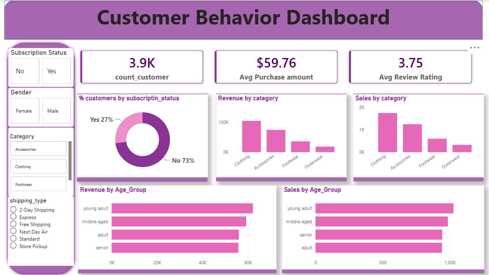

# 🛍️ Customer Shopping Behavior Analysis

## 📌 Project Overview

This project presents an end-to-end analysis of customer shopping behavior using Python, PostgreSQL, SQL, and Power BI. The objective is to uncover customer purchasing patterns, spending behavior, product preferences, subscription trends, and business opportunities through interactive visualizations and data-driven insights.

The project follows the complete data analytics lifecycle, including data cleaning, feature engineering, SQL-based business analysis, and dashboard development to support informed business decision-making.

---

## 🎯 Business Objective

The primary goals of this project are to:

- Analyze customer purchasing behavior across different demographics.
- Identify high-value customers and purchasing trends.
- Understand the impact of subscriptions and discounts on sales.
- Evaluate product performance and customer satisfaction.
- Provide actionable business recommendations through interactive dashboards.

---

## 🛠️ Technologies Used

| Technology | Purpose |
|------------|---------|
| Python | Data Cleaning & Feature Engineering |
| Pandas | Data Manipulation & Exploratory Data Analysis |
| PostgreSQL | Database Storage |
| SQL | Business Analysis |
| Power BI | Interactive Dashboard |
| DAX | KPI Calculations |
| Power Query | Data Transformation |

---

## 📂 Dataset Information

**Dataset Name:** Customer Shopping Behavior Dataset

### Dataset Summary

- **Total Records:** 3,900
- **Total Columns:** 18

### Dataset Includes

- Customer Demographics
- Purchase Information
- Product Categories
- Subscription Status
- Discounts & Promotions
- Review Ratings
- Shipping Details
- Purchase Frequency

---

# 🔄 Project Workflow

```text
Raw Dataset (.csv)
        │
        ▼
Python (Data Cleaning & Feature Engineering)
        │
        ▼
PostgreSQL Database
        │
        ▼
SQL Business Analysis
        │
        ▼
Power BI Data Modeling
        │
        ▼
Interactive Dashboard
        │
        ▼
Business Insights & Recommendations
```

---

# 🧹 Data Preprocessing (Python)

The dataset was cleaned and prepared using Python.

### Tasks Performed

- Imported dataset using Pandas
- Checked missing values
- Imputed missing Review Ratings using median values
- Standardized column names
- Created Age Group feature
- Created Purchase Frequency feature
- Removed redundant columns
- Loaded cleaned data into PostgreSQL

---

# 🗄️ SQL Business Analysis

The following business questions were answered using SQL:

- Revenue generated by Male vs Female customers
- High-spending customers using discounts
- Top-rated products
- Shipping type comparison
- Subscribers vs Non-Subscribers spending
- Products most dependent on discounts
- Customer segmentation
- Top-selling products by category
- Repeat buyers vs subscription behavior
- Revenue contribution by age group

---

# 📊 Power BI Dashboard Features

The dashboard provides interactive visualizations including:

- Executive Summary
- Customer Demographics
- Revenue Analysis
- Product Category Analysis
- Subscription Analysis
- Discount Analysis
- Customer Segmentation
- Purchase Frequency Analysis
- Interactive Filters & Slicers
- KPI Cards

---

# 📈 Key Performance Indicators (KPIs)

- Total Customers
- Total Revenue
- Average Purchase Amount
- Subscription Rate
- Repeat Customers
- Average Customer Rating
- Total Orders
- Discount Utilization

---

# 📌 Business Insights

Some key insights generated from the analysis include:

- Subscribers contribute significantly more revenue than non-subscribers.
- Certain product categories consistently receive higher customer ratings.
- Customers using express shipping generally have higher purchase values.
- Repeat customers demonstrate greater purchasing frequency and lifetime value.
- Discount campaigns increase sales but require careful optimization to maintain profitability.
- Young and middle-aged customer segments contribute the largest share of revenue.

---

# 💡 Business Recommendations

Based on the analysis, the following recommendations were made:

- Expand subscription programs with exclusive member benefits.
- Introduce customer loyalty rewards for repeat buyers.
- Optimize discount strategies to improve profitability.
- Promote top-rated products through targeted marketing campaigns.
- Focus personalized marketing efforts on high-value customer segments.
- Enhance inventory planning using purchase frequency trends.

---

# 📁 Repository Structure

```
Customer-Shopping-Behavior-Analysis
│
├── Customer_Shopping_Behavior.pbix
├── customer_shopping_behavior.csv
├── README.md
│
├── screenshots
│   ├── Dashboard.png
│
│
└── report
    └── Customer Shopping Behavior Analysis Report.pdf
```

---

# 📷 Dashboard Preview

## Executive Dashboard

> *(Add Screenshot Here)*

```markdown

```

---

# 🎯 Skills Demonstrated

- Data Cleaning
- Data Wrangling
- Exploratory Data Analysis (EDA)
- Feature Engineering
- SQL Query Writing
- PostgreSQL
- Data Modeling
- Power Query
- DAX
- Interactive Dashboard Design
- Business Intelligence
- Data Visualization
- Analytical Thinking

---

# 🚀 Future Enhancements

- Customer Churn Prediction using Machine Learning
- Sales Forecasting
- Recommendation System
- Customer Lifetime Value Analysis
- Real-time Dashboard using Streaming Data
- Azure SQL & Power BI Service Integration

---

# 👩‍💻 Author

**Karanki Lahari**

**Skills:** Power BI | SQL | PostgreSQL | Python | Pandas | Excel | Data Analytics

---

## ⭐ If you found this project useful, consider giving it a star!
